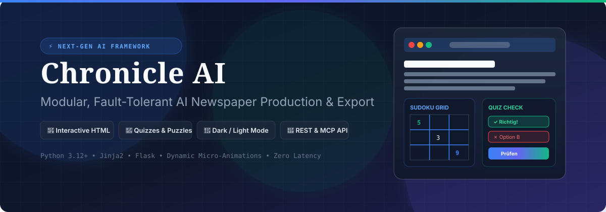

<p align="center">
  
</p>

# Chronicle AI - Newspaper Framework for LLMs

[](https://www.python.org/downloads/)
[](LICENSE)
[](#running)

A modular, fault-tolerant Python framework designed for AI-powered newspaper production. Supports interactive articles, quizzes, sudoku, crosswords, and multiple export formats with responsive, fully-animated HTML outputs.

---

## 🎨 CI & Design System ("Chronicle Modern Editorial")

The framework features a custom-designed **Corporate Identity (CI)** and modern UI/UX system:

- **App Logo & Banner**: Distinctive SVG branding (`assets/logo.svg` & `assets/banner.svg`).
- **Dark Mode & Light Mode**: Built-in system detection (`prefers-color-scheme`) with interactive manual toggle switch and `localStorage` state persistence.
- **Directional & Micro-Animations**:
  - **Reading Direction Progress Bar**: Top-anchored indicator tracking reading depth.
  - **Staggered Entrance**: Articles and cards slide and fade up gracefully into view.
  - **Interactive Feedback**: Pulse success animations on correct quiz/sudoku/crossword inputs and shake animations on errors.
  - **Auto-Advance Crossword Inputs**: Smooth directional navigation as letters are typed.
- **Responsive Editorial Grid**: CSS Grid/Flexbox layout featuring lead feature articles and structured puzzle cards optimized for mobile, tablet, and desktop viewports.

---

## 🚀 Quick Start

```python
from src.newspaper import Newspaper, QuizSystem
from src.newspaper.content.crossword import CrosswordGenerator

# Initialize newspaper
paper = Newspaper("AI Morning News")

# Add lead article
paper.add_article(
    title="AI Revolutionizes Newspaper Production",
    content="The Newspaper Framework allows LLMs to create high-quality, interactive newspapers with minimal effort...",
    author="AI Editor",
    category="Technology",
    priority=1
)

# Set brand logo
paper.set_logo("assets/logo.svg")

# Add interactive quiz
quiz = QuizSystem("Technology Quiz")
quiz.add_question(
    "What is AI?",
    ["Artificial Intelligence", "Kitchen International", "Merchant Institute", "No Idea"],
    0,
    "Technology"
)
paper.add_quiz(quiz)

# Add Sudoku puzzle
paper.add_sudoku("medium")

# Add Crossword puzzle
crossword = CrosswordGenerator(
    words=["python", "html"],
    clues={"python": "A popular programming language.", "html": "A markup language for the web."},
)
paper.add_crossword(crossword.generate())

# Export interactive HTML & structured JSON
paper.export_html("sample_newspaper.html")
paper.export_json("sample_newspaper.json")
```

---

## ✨ Features

- **LLM-Friendly API**: Intuitive method names with fault-tolerant error handling (`force=True`).
- **Interactive HTML Outputs**: Embedded JavaScript evaluation for quizzes, sudoku validation, and crossword checking.
- **Automatic Validation**: Validation checks on titles, content length, and puzzle structures.
- **Modular Architecture**: Clean `src/` layout adhering to DRY and SOLID software design principles.
- **Rich Content Support**: Articles, multi-question quizzes, 9x9 Sudoku puzzles, and dynamic Crosswords.
- **Multiple Export Formats**: HTML (Jinja2 templates with autoescape and theme switching) and JSON.
- **REST & MCP Server Integration**: Flask-based HTTP API and Model Context Protocol (MCP) server for direct LLM tool usage.

---

## 💻 Installation

```bash
pip install -r requirements.txt
```

---

## 📁 Project Structure

```
assets/                 CI branding assets (logo.svg, banner.svg)
src/newspaper/          Core Python package
  core.py               Newspaper class (main entry point)
  models.py             Article, Question, LayoutConfig, MediaConfig models
  exceptions.py         NewspaperFrameworkError + NewspaperFrameworkWarning
  content/              Quiz, Sudoku, Crossword generators
  export/               HTML (Jinja2) and JSON exporters
  export/templates/     Interactive HTML template with Dark/Light mode & JS animations
src/api/                REST API and MCP server endpoints
tests/                  pytest unit test suite
run_api.py              REST API server runner
run_mcp.py              MCP server runner
sample_generator.py     Example newspaper generator script
```

---

## 🧪 Running & Verification

```bash
# Generate sample newspaper (HTML & JSON)
python sample_generator.py

# Start REST API server
python run_api.py

# Run full pytest test suite
python -m pytest
```

---

## 📖 API Reference

### Newspaper Core Methods

| Method | Description |
|--------|-------------|
| `add_article(title, content, force=False, **kwargs)` | Adds an article (min. 10 chars content unless `force=True`) |
| `set_logo(logo_path)` | Sets newspaper header logo |
| `add_quiz(quiz)` | Adds a `QuizSystem` instance |
| `add_sudoku(difficulty)` | Generates and adds a Sudoku ("easy", "medium", "hard") |
| `add_crossword(crossword)` | Adds a crossword puzzle |
| `generate()` | Returns structured dictionary representation |
| `export_html(filename)` | Exports interactive, responsive HTML output |
| `export_json(filename)` | Exports structured JSON output |

### REST API Endpoints

| Endpoint | Method | Description |
|----------|--------|-------------|
| `/api/newspaper` | POST | Create a new newspaper instance |
| `/api/newspaper/<id>/article` | POST | Add an article to a newspaper |
| `/api/newspaper/<id>/quiz` | POST | Add a quiz to a newspaper |
| `/api/newspaper/<id>/sudoku` | POST | Add a sudoku to a newspaper |
| `/api/newspaper/<id>/crossword` | POST | Add a crossword to a newspaper |
| `/api/newspaper/<id>/export` | POST | Export newspaper as HTML or JSON |

---

## 📄 License

MIT License. See [LICENSE](LICENSE) for details.
